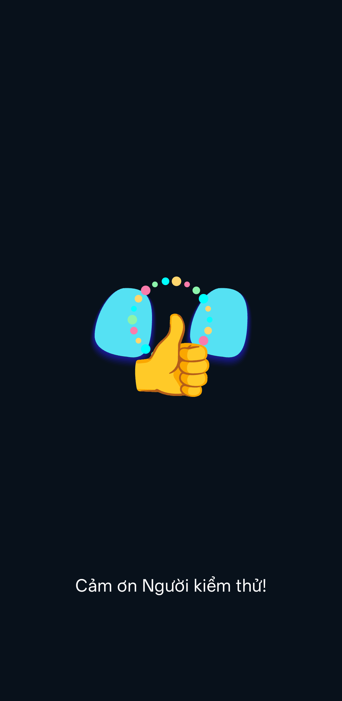
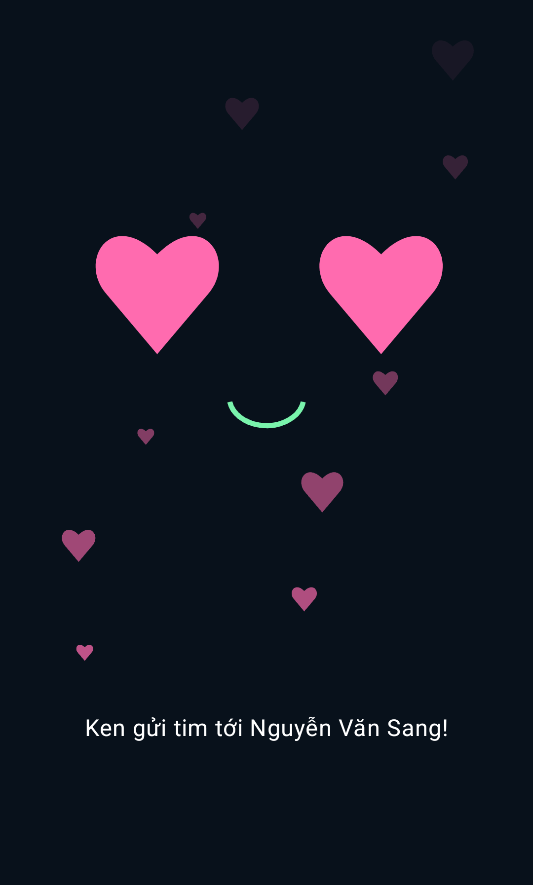
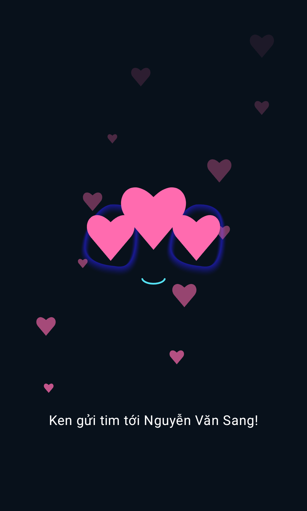

# Tương tác cử chỉ với người quen

Trong tab **Người quen**, bật **Phản ứng cử chỉ người quen** (mặc định bật). Đăng ký mặt của người dùng trước, đánh thức Ken và cho phép camera. Không cần đăng ký giọng để dùng cử chỉ.

Chỉ để một người trong hình, mặt và tay đủ sáng. Robot cần nhận diện được người đã đăng ký, bàn tay ở gần người và các ngón không bị che. Sau khi xác nhận mặt, robot có thể giữ danh tính qua cơ thể khi người quay mặt đi; xem [theo dõi người và tự học mẫu](PERSON_TRACKING_VI.md). Giữ tư thế khoảng nửa giây (đập tay khoảng một giây); riêng vẫy tay cần vẫy qua lại ít nhất hai lần đổi hướng. Hạ tay ít nhất nửa giây trước khi làm lại. Có thể đổi cử chỉ trực tiếp; các phản ứng cách nhau tối thiểu một giây.

| Cử chỉ | Hiệu ứng |
|---|---|
| Thả tim ngón cái và ngón trỏ | Mắt trái tim, tim hồng bay lên, lời nhắn có tên |
| Trái tim bằng hai tay | Mắt trái tim, tim lớn và các tim nhỏ bay lên |
| Vẫy chào | Bàn tay vẫy, lời chào có tên |
| Giơ ngón cái | Ken cười, biểu tượng 👍 lớn và các tia sáng |
| Chữ V | Ken cười, confetti ăn mừng |
| Nắm tay | Ken cười, biểu tượng nắm tay chạm nhẹ |
| Xòe tay giữ yên | Đập tay ✋ |
| Ngón cái hướng xuống | Ghi nhận ý kiến 🥺 |
| Ngón trỏ hướng lên | Bóng đèn ý tưởng 💡 |
| I love you (cái, trỏ, út duỗi) | Tim bay |
| OK (cái chạm trỏ, ba ngón duỗi) | Đồng ý 👌 |
| Rock (trỏ và út duỗi, cái gập) | Rock 🤘 |

Hiệu ứng kéo dài 2,8 giây, hiển thị trên giao diện thường và chế độ đế robot. Chữ phản hồi gọi tên người đã nhận diện. Phản ứng chỉ dùng màn hình, không phát thêm giọng nói hay ngắt hội thoại. Hiệu ứng không chặn thao tác bấm nút. Có thể tắt tính năng riêng mà vẫn giữ nhận diện mặt/giọng.

Màn hình dock hiển thị trạng thái nhận diện ở phía trên. Chờ dòng **Đã nhận diện: [tên] · sẵn sàng nhận cử chỉ** trước khi giơ tay. Nếu hiện **Chưa nhận ra người quen**, nhìn thẳng, giữ nguyên vị trí và ánh sáng; có thể thu lại mẫu mặt trong tab Người quen với góc đặt dock thực tế. Nếu camera thấy nhiều mặt, chỉ để người đang tương tác trong hình. Khi Ken ngủ, chạm mặt để đánh thức.

## Khi giơ like nhưng Ken không phản ứng

Nhận được nhãn `Thumb_Up` chưa đủ để phát hiệu ứng: cùng lúc phải xác nhận được người đã đăng ký, tay ở gần người và tư thế giữ đủ lâu. Ngưỡng mặt người dùng đặt cao hoặc mẫu mặt khác nhiều so với góc/ánh sáng hiện tại có thể chặn phản ứng dù model tay đã nhận ra like. Không tự hạ ngưỡng mặt hay thay mẫu đã lưu khi chẩn đoán.

Bản debug có log `RobotGesture` về số mặt, điểm so khớp, trạng thái xác nhận, nhãn/điểm bàn tay, lý do chặn, vùng cơ thể/cổ tay và sự kiện phát hiệu ứng. `RobotGestureUi` ghi sự kiện hiển thị trong giao diện. Log không chứa tên, ảnh hay vector mẫu. Bản release chỉ chạy model cử chỉ khi đã xác nhận người quen; bản debug còn chạy với một người chưa xác định để tìm nguyên nhân không phản ứng. Cả dock và giao diện thường hướng dẫn khi tay bị cắt, ở xa người hoặc cử chỉ chưa rõ.

## Cách nhận diện và giới hạn

- Dùng model MediaPipe sẵn trong app, tối đa hai bàn tay, chạy `VIDEO` với timestamp tăng liên tục để theo dõi tay qua các khung. Detection/presence/tracking dùng 0,50 theo cấu hình mặc định của MediaPipe; vẫn kiểm tra hình học, chủ sở hữu và thời gian giữ ở bước sau.
- Like dùng điểm bắt đầu 0,60/duy trì 0,55; các nhãn stock khác 0,65/0,60. Kết hợp bỏ phiếu nhiều khung và hình học 3D; xem [nghiên cứu, thời gian xác nhận và giới hạn bản V2](GESTURE_V2_RESEARCH_VI.md). Điểm model không phải xác suất đúng.
- Cho phép tối đa 4 điểm đầu ngón vượt biên ảnh không quá 0,05; cổ tay và các khớp gốc ngón vẫn phải nằm trong hình. Bàn tay bị cắt đáng kể, điểm không hữu hạn hoặc quá nhỏ vẫn bị từ chối.
- Thả tim và tim hai tay dùng quy tắc hình học trên 21 điểm bàn tay; vẫy tay dùng chuỗi chuyển động cổ tay. Các phép đo có hiệu chỉnh tỷ lệ khung hình. Đây là quy tắc bổ sung, chưa phải model đã huấn luyện riêng trên ảnh thả tim.
- Chỉ xét khi có đúng một người hiện diện rõ, đã xác nhận bằng mặt hoặc đang được theo dõi qua cơ thể. Ghép tay với vùng người; khi có đủ hai cổ tay tư thế thì thêm điều kiện khoảng cách tới cổ tay. Chỉ có một cổ tay không đủ để loại bàn tay thuộc cánh tay còn lại, nên dùng vùng cơ thể làm fallback. Khi model chưa thấy cơ thể, dùng vùng gần mặt và thời gian giữ danh tính ngắn. Có nhiều người, liên kết mơ hồ hoặc chưa nhận ra người thì không phản ứng.
- Tạm dừng phản ứng trong lúc thu mẫu mặt/giọng. Hiệu ứng đã được xác nhận được chạy hết 2,8 giây khi hạ tay hoặc phát hiện người chập chờn; điều này không cho phép phát cử chỉ mới nếu mất danh tính. Nhiều người, người quen khác, đổi cảnh, lỗi camera, ngủ hoặc vào nền xóa phản ứng hiện tại. Chuyển tab không phát lại sự kiện cũ; đồng hồ đơn điệu giữ thời hạn hiệu ứng.
- Camera, điểm bàn tay và phân loại xử lý cục bộ. Không upload ảnh hoặc lưu mẫu tay để dùng tính năng này.

Hai kiểu tim cần thử trên điện thoại thật với tay trái/phải, góc camera và ánh sáng khác nhau để hiệu chỉnh. Các bài test hình học bằng điểm giả lập không xác nhận độ chính xác với mọi bàn tay thật.

## Kiểm thử

Domain: `GestureInteractionTest` kiểm tra 12 cử chỉ, thời gian giữ/hạ tay/cooldown, người lạ/nhiều mặt, điểm yếu, tư thế không hỗ trợ, tay ngoài vùng, hai tay không tạo tim, ảnh méo tỷ lệ, vẫy tay và thời hạn hiệu ứng.

Android: `GestureInteractionPlatformTest` kiểm tra model trên ảnh mẫu MediaPipe, nhận hai tay, bảo toàn bitmap nguồn, 12 hiệu ứng có tên, tự hết hạn, không chặn nút và hiển thị trên mặt Ken/đế robot. Ảnh minh họa hiệu ứng được tạo từ sự kiện giả lập trong test Compose.

Kết quả ngày 07/10/2026: build APK ứng dụng và APK kiểm thử thành công với JDK 17; 30/30 domain test, 2/2 app unit test qua. Trên `emulator-5556`, 6/6 bài hồi quy nhận diện qua và 3/3 bài cử chỉ qua sau khi sửa đồng hồ kiểm thử animation và giữ ngưỡng stock 0,65. Ảnh ngón cái mẫu trả `Thumb_Up` với điểm 0,74444705; model nhận được hai tay trong ảnh mẫu thứ hai. Chưa nghiệm thu hai kiểu tim qua camera người thật.

Sau thử trực tiếp trên OPPO, bổ sung thông báo sẵn sàng trên dock. Build và unit test qua; 5/5 instrumentation test liên quan (2 trạng thái người quen, 3 cử chỉ) qua trên máy giả lập. Lượt thử camera thật ghi nhận được ngón cái, nhưng chưa phát hiệu ứng vì người dùng chưa được xác nhận ổn định ở thời điểm giơ tay. Chưa nghiệm thu phản ứng like trên camera thật.

Cập nhật sau lượt chẩn đoán like cùng ngày: người dùng đã xác nhận thấy animation trên camera OPPO thật; log ghi được ba sự kiện `THUMBS_UP` cùng ba lần `RobotGestureUi` hiển thị. Sửa chặn nhầm khi pose chỉ có một cổ tay, bỏ cổ tay pose ngoài ảnh, xử lý dao động điểm và đầu ngón vượt biên nhẹ, để hiệu ứng đã xác nhận chạy hết, đổi phản hồi thành 👍 lớn. Các lần ghi này xác nhận luồng hoạt động, chưa đo tỷ lệ nhận đúng.

Sau phản hồi độ nhạy thấp: chuyển nhận diện tay sang VIDEO, hiệu chỉnh like 0,60/0,55; reset tracking tay khi đổi kích thước ảnh, gián đoạn quá 1,5 giây, đổi cảnh hoặc dừng camera. Build qua, 52 domain và 2 app unit test qua; 9/9 bài trên OPPO qua, gồm model nhận một/hai tay, tay rời hình, model-to-animation trên Ken/dock, trạng thái UI và model body/pose. Log tiếp theo tìm được hai lượt like chỉ có hai khung hợp lệ cách nhau 506/514 ms, nên rút thời gian giữ riêng like xuống 450 ms và thêm test phát lại các nhịp/điểm này. Các tín hiệu chưa xác nhận người quen hoặc tay bị cắt đáng kể vẫn chặn. Cần thử 3 lượt giơ/hạ tay và khoảng tay bình thường để đánh giá độ nhạy và phản ứng nhầm sau hiệu chỉnh.

Bản cuối 450 ms: build và 53 domain/2 app unit test qua; 9/9 bài OPPO chạy lại qua, APK cài qua USB và mở lại app với hồ sơ hiện có. Số lượt like đúng/sai qua camera thật sau hiệu chỉnh cần ghi nhận riêng, không suy ra từ ảnh mẫu.

Camera thật sau cài bản cuối đã ghi ít nhất 6 sự kiện `THUMBS_UP` và 6 lần UI hiển thị đúng hiệu ứng. Vẫn có khung bị chặn do tay bị cắt, điểm thấp hoặc cần hạ tay trước lượt tiếp theo. Số sự kiện này không phải tỷ lệ nhận đúng hoặc bằng chứng không phản ứng nhầm; phản hồi số lượt thử và đoạn tay bình thường cần đối chiếu riêng.

Tài liệu MediaPipe: https://ai.google.dev/edge/mediapipe/solutions/vision/gesture_recognizer/android
