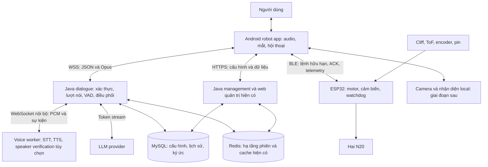

# Kiến trúc toàn dự án RobotAI

Ngày: 03/10/2026. Trạng thái: thiết kế đề xuất để triển khai sau khi người dùng phê duyệt tính năng P2. Tài liệu này không xác nhận các module mới đã được lập trình hoặc triển khai.

## 1. Phạm vi và nền tảng

Người dùng xác nhận P0 hoàn thành; P1 đang xem xét phần cứng. P2 được phát triển độc lập bằng điện thoại Android và server, sau đó nối đế khi P1 sẵn sàng. Phạm vi chính là F01–F14 đã phê duyệt. Sáu tính năng bổ sung được giữ trong thiết kế, triển khai tăng dần sau luồng hội thoại cơ bản, không bỏ khỏi lộ trình.

- Android: thu/phát audio, màn hình mắt, thao tác người dùng, biểu cảm, camera khi bật, BLE và hành vi tại chỗ.
- Server: STT/TTS tiếng Việt, LLM, điều phối hội thoại, tính cách, ngữ cảnh, dữ liệu và công cụ.
- ESP32: hai N20, cảm biến, điều khiển tốc độ và dừng an toàn độc lập.
- Tái sử dụng `server-java`; app offline `android-app/whisper-test` giữ làm công cụ đối chứng. Đề xuất tạo app robot nhẹ tại `android-app/robot-app`, không đóng gói model STT/TTS vào APK robot.
- Ưu tiên một robot, một người nói mỗi lượt. Đo tải trước khi tăng số robot; không suy ra năng lực đồng thời từ cấu hình điện thoại.

Skill áp dụng từ project:

- [Android Clean Architecture](../android-app/.agents/skills/android-clean-architecture/SKILL.md): domain Kotlin độc lập Android, dependency hướng vào domain, use case và adapter rõ ràng.
- [Hexagonal Architecture](../server-java/.agents/skills/hexagonal-architecture/SKILL.md): port/adapter cho inference, LLM và lưu trữ; đưa vào backend hiện có theo từng luồng, tránh viết lại toàn bộ.

## 2. Sơ đồ tổng thể



Tận dụng hai tiến trình Java management/dialogue đã có; không thêm các dịch vụ riêng cho mỗi tính năng. Voice worker tách ra vì runtime model và tài nguyên GPU khác JVM. Ban đầu có thể chạy STT/TTS trong một tiến trình worker, nhưng có hàng đợi và giới hạn tài nguyên riêng; tách hai worker nếu phép đo chứng minh tranh chấp ảnh hưởng độ trễ.

## 3. Hiện trạng code và phần cần bổ sung

Nhận xét dưới đây dựa trên đọc source trong workspace, không phải xác nhận runtime P0.

| Thành phần hiện có | Bằng chứng | Cách sử dụng / phần bổ sung |
|---|---|---|
| Spring Boot 3.5.8, Java 21, Maven nhiều module | `server-java/pom.xml` | Giữ toolchain đang dùng; không nâng phiên bản trong P2 nếu không cần |
| WebSocket có interceptor xác thực | `xiaozhi-dialogue/.../server/websocket/WebSocketConfig.java` | Giữ endpoint `/ws/xiaozhi/v1/`; thêm khả năng thương lượng extension RobotAI |
| STT nhận Flux audio, callback partial | `xiaozhi-ai/.../stt/SttService.java` | Adapter worker; partial capability phải được khai báo theo model thực tế |
| VAD, SpeechTurn, epoch và abort | `xiaozhi-dialogue/.../dialogue/DialogueService.java` | Tái sử dụng guard hủy nội bộ; ánh xạ sang mã lượt truyền tới Android |
| Callback partial đang phục vụ barge-in | `DialogueService.onSttPartialText` | Bổ sung phát phụ đề partial có revision, không thay đổi guard ngắt lời hiện có |
| TTS provider trả Path | `xiaozhi-ai/.../tts/TtsService.java` | Thêm port streaming PCM bên cạnh provider file hiện tại |
| Synthesizer → Player có Flux và cancel | `xiaozhi-dialogue/.../dialogue/playback/Synthesizer.java` | Thêm streaming synthesizer, giữ file synthesizer cho provider cũ |
| MySQL, Redis, management, dialogue và web | `server-java/docker-compose.yml` | Giữ hạ tầng hiện có; chưa thay MySQL bằng database mới |
| App Compose, Recorder, VoiceSegmenter, AudioTrack/TTS test | `android-app/whisper-test/app/src/main` | Tái sử dụng phần đã kiểm chứng qua adapter; không coi segmenter energy hiện có là giải pháp VAD/AEC hoàn chỉnh |

## 4. Android: phân lớp và trách nhiệm

Khởi đầu bằng các package trong một app và một module domain độc lập; chỉ tách Gradle module audio/face/data khi thực sự cần. Cấu trúc đích:

```text
android-app/robot-app/              # đề xuất, chưa tạo app
  app/                             # entry point và dependency wiring
  domain/                          # Kotlin, không import Android/network/Room
    conversation/                  # state, turn, use cases
    persona/                       # cấu hình tính cách
    robot/                         # capability, action, result
    ports/                         # Audio, Backend, Robot, History, Clock
  app/src/main/.../
    presentation/                  # Compose, ViewModel, robot face
    data/backend/                  # WSS, HTTPS, mapping DTO
    data/audio/                    # AudioRecord, Opus, AudioTrack, AEC
    data/local/                    # settings, cache, diagnostics
    data/robot/                    # BLE và simulator
    behavior/                      # biểu cảm và hoạt cảnh local
```

Quy tắc phụ thuộc: presentation/data → domain; app ghép adapter với use case. Domain không phụ thuộc model AI, Android, BLE hay DTO của Xiaozhi. ViewModel nhận UI state, không trực tiếp điều khiển AudioRecord hoặc quyết định hủy worker.

Use case chính: ConnectRobotSession, StartListening, FinishUtterance, InterruptResponse, EndConversation, StartNewConversation, SetMicMuted, UpdatePersona, DeleteHistory, ExecuteRobotAction.

### Audio và vòng đời

- AudioRecord thu PCM; resample nếu phần cứng không thu trực tiếp được sample rate đã thỏa thuận. Encoder Opus gửi frame ngay, độc lập render UI.
- AudioTrack phát PCM giải mã từ Opus; buffer có giới hạn theo thời lượng, không gom toàn bộ câu trả lời. Mục tiêu buffer khởi đầu 120–240 ms, điều chỉnh bằng phép đo jitter.
- Hàng đợi upload ban đầu tối đa khoảng 1 giây; vượt giới hạn thì báo mạng chậm và kết thúc lượt lỗi, không âm thầm bỏ frame giữa câu.
- Không đổ vô hạn audio download vào queue hoặc buffer AudioTrack. Dùng playback progress và flow control; nếu không giữ được thời gian thực thì dừng lượt có thông báo thay vì đọc tiếng cũ nhiều giây sau đó.
- Tắt mic thực sự ngừng thu và upload; vẫn cho phép phát câu trả lời. Kết thúc phiên giải phóng recorder, player, codec và subscription.
- Robot mode chạy foreground. Nếu cần tiếp tục khi app ra nền, dùng foreground service loại microphone đúng quyền và lifecycle theo Android mục tiêu; không mặc định luôn nghe nền.
- Camera mặc định tắt trong P2 cơ bản. Điều khiển audio focus, cuộc gọi đến, đổi thiết bị audio và app bị pause: dừng/giải phóng an toàn, không tự phát lại câu cũ.

### Biểu cảm và mô phỏng phần cứng

FaceRenderer 2D vẽ mắt; BehaviorController local phối hợp nhìn/chớp mắt và trạng thái nghe/nói. Trạng thái nói bắt đầu khi Android thực sự phát audio, kết thúc khi phần cuối đã phát hết, không chỉ khi server gửi `tts.stop`.

Emotion chỉ nhận enum cho phép và cường độ giới hạn. Không chạy code hoặc script do LLM gửi. RobotPort có BleRobotAdapter và SimulatedRobotAdapter; simulator báo rõ chưa có phần cứng và không trả về kết quả đo giả.

## 5. Backend Java: port và adapter trong cấu trúc hiện có

Giữ năm Maven module: common, service, ai, dialogue, server. Module mới chưa cần thiết. Domain/application bổ sung nằm trong feature hội thoại; controller/WebSocket chỉ parse, xác thực và chuyển sự kiện cho application.

| Port đề xuất | Trách nhiệm | Adapter đầu tiên |
|---|---|---|
| StreamingSttPort | Mở lượt, nhận PCM, endpoint, partial/final, cancel | Voice worker; bọc SttService cũ khi cần đối chứng |
| StreamingTtsPort | Text đủ nghĩa → PCM chunks, completion, cancel | VieNeu worker; adapter file cũ chỉ là chế độ tương thích |
| ChatModelPort | Ngữ cảnh → text/token stream và tool request | LLM provider đang cấu hình trong Java |
| ConversationRepository | Lịch sử text, trạng thái hủy, giới hạn ngữ cảnh | MySQL hiện có |
| PersonaRepository | Tên, xưng hô, phong cách, voice configuration | Cấu hình role/persona hiện có |
| RobotActionPort | Capability discovery và lệnh hữu hạn | Android tool bridge, sau đó BLE |
| MemoryRepository | Ký ức được người dùng cho phép, xem/sửa/xóa | Bổ sung sau lịch sử phiên |

ConversationCoordinator là nơi quản lý một lượt logic: endpoint → final STT → ngữ cảnh → LLM → phân câu → TTS → gửi audio. Mỗi session xử lý sự kiện tuần tự qua executor hiện có; inference/network nặng chạy ngoài luồng nhận WebSocket.

CancellationScope quản lý subscription LLM/TTS/STT, queue và generation. Cancellation là best effort tại model; guard generation bảo đảm kết quả model không hủy được cũng không đến player.

SentenceAssembler gom token thành câu/cụm đủ nghĩa, có giới hạn độ dài và thời gian chờ. Không gửi từng token cho TTS. TTS xử lý câu theo thứ tự; nếu prefetch câu sau thì playback vẫn theo sentence_id.

## 6. Voice worker và lựa chọn model

Đề xuất Python worker với WebSocket nội bộ cho PCM và JSON lifecycle; Java là client duy nhất. Dùng HTTP cho health/readiness và quản trị worker. Worker không chứa LLM, lịch sử hay điều khiển robot.

Model nạp một lần khi khởi động. Readiness chỉ true khi model đã nạp và có thể xử lý. STT/TTS/speaker verification có capability, queue bounded, timeout, admission control và telemetry riêng.

- STT: PhoWhisper là baseline chất lượng tiếng Việt theo các thử nghiệm trước. Giữ cấu hình thay model small/large phía server; quyết định model chạy chính căn cứ benchmark GPU server. Không gọi PhoWhisper là model online nguyên bản.
- Khi dùng PhoWhisper cho F04, adapter phải triển khai incremental window/overlap, giới hạn backlog, revision text và nhận dạng final khi endpoint. Không chỉ chia câu thành đoạn rồi ghép mù; tránh mất từ ở biên và lặp từ. Nếu tốc độ không đáp ứng, lựa chọn adapter streaming tiếng Việt khác cần benchmark cùng bộ câu.
- TTS: giữ VieNeu-TTS-v3-Turbo và giọng Hải Đăng đã chọn làm cấu hình xuất phát. Worker phải trả PCM theo phần; chuyển lên server nhưng vẫn trả file WAV cuối cùng không đạt F05.
- Không lấy độ trễ TTS/STT trên điện thoại làm số đo server. RAM/VRAM và việc STT/TTS dùng chung GPU cần đo; chưa chốt loại GPU hoặc số phiên tối đa.

Port contract nội bộ: mở stream gồm session_id, generation, turn_id, request_id, audio format/model config; gửi PCM S16LE mono cho STT; `endpoint` hoàn tất audio; trả partial/final/error. TTS nhận sentence_id/text/voice_id và trả PCM chunks với thông số đầu ra, cuối stream và lỗi. Các response đều mang request_id để adapter loại dữ liệu đến muộn. Xem contract client tại tài liệu liên kết bên dưới.

## 7. Luồng hội thoại và trạng thái

```mermaid
sequenceDiagram
    participant U as Người dùng
    participant A as Android
    participant J as Java
    participant W as Voice worker
    participant L as LLM
    U->>A: Bắt đầu nói
    A->>J: listen.start và Opus frames liên tục
    J->>W: PCM theo frame
    W-->>J: partial text nếu hỗ trợ
    J-->>A: Phụ đề partial và revision
    J->>W: endpoint sau im lặng / nút kết thúc
    W-->>J: final text
    J->>L: Ngữ cảnh và final text
    L-->>J: Token stream
    J->>W: Câu/cụm đủ nghĩa và voice_id
    W-->>J: PCM chunks
    J-->>A: TTS events và Opus frames
    A-->>U: Phát phần đầu, mắt đang nói
    U->>A: Ngắt lời
    A->>A: Dừng và xóa buffer ngay
    A->>J: abort mã lượt cũ
    J->>W: Hủy job cũ
    J->>L: Hủy subscription
    J-->>A: abort_ack; kết quả cũ bị loại
```

Tách trạng thái connection (disconnected/connecting/ready/reconnecting) khỏi conversation (idle/listening/finalizing/thinking/speaking/interrupted/error). Mic mute là thuộc tính độc lập. Ở chế độ full duplex, speaking và thu mic có thể đồng thời; không dùng một enum khiến hai hoạt động loại trừ nhau.

Backend quyết định endpoint tự động để tránh Android và server cùng kết thúc một lượt khác thời điểm. Android cung cấp nút finish thủ công. VAD chỉ tìm hoạt động tiếng nói; không chứng minh tiếng đó hướng tới robot.

Nút interrupt dừng playback tại Android trước khi chờ network. Ngắt bằng giọng cần AEC và phép đo tiếng vọng/nhiều người; nếu không đạt thì dùng chế độ bán song công và nút ngắt, hiển thị rõ hạn chế. Android AEC cần kiểm tra availability và gắn đúng audio session; có API không bảo đảm chất lượng mọi điện thoại.

Chỉ final STT không rỗng, chưa bị hủy mới mở một response LLM. Partial có thể thay đổi và không được ghi thành message cuối. LLM text không phải lời robot đã phát hết; lưu thêm trạng thái completed/interrupted/failed và playback progress, tránh ngữ cảnh nói rằng robot đã đọc toàn bộ câu bị ngắt.

## 8. Giao thức, dữ liệu và bảo mật

Android↔Java dùng WSS, JSON điều khiển và Opus binary theo nền Xiaozhi. Uplink xuất phát mono 16 kHz, frame 60 ms; downlink thương lượng riêng. Chuẩn hóa sample rate worker ở adapter. Thiết kế extension và audio gắn mã lượt nằm trong [contract P2](P2_PROTOCOL_CONTRACT_VI.md).

Thương lượng capability trước khi dùng extension; không giả định client Xiaozhi chuẩn hiểu trường RobotAI. Không thay binary v1 bằng header mới khi chưa được cả hai phía chấp nhận. Chế độ tương thích raw Opus không có mã lượt audio phải dùng barrier hủy/queue drain; không tuyên bố đạt khả năng loại frame theo turn_id như extension.

Database chính vẫn là MySQL. Redis phục vụ chức năng hiện có, không thêm Redis queue vào đường audio nóng. Room chỉ dùng khi app thực sự cần lịch sử/cache local có cấu trúc; settings nhỏ dùng DataStore. Không sao chép toàn bộ dữ liệu server xuống điện thoại mặc định.

Data model logic cần ánh xạ vào bảng hiện có và migration có kiểm tra, chưa tạo bảng mới trong bước thiết kế:

- Device, PersonaProfile, Conversation, Turn, Message, ConsentSettings.
- Turn có ID, trạng thái, model/voice version và timestamps; Message liên kết Turn, role và text final.
- PerformanceSample giữ độ trễ và lỗi, không chứa audio/text nhạy cảm mặc định.
- MemoryItem và Reminder là phần mở rộng; không trộn ký ức lâu dài với context tạm của một session.

Mặc định không lưu audio lâu dài. Phải kiểm tra/tắt đường ghi audio và TTS cache của backend cũ khi áp dụng chính sách này; không chỉ đổi UI. Xuất WAV/log chi tiết chỉ khi người dùng bật chẩn đoán. Xóa hội thoại phải xóa cache liên quan, bản local và ký ức dẫn xuất theo lựa chọn; backup có thời hạn lưu được công bố.

Device token giữ bằng cơ chế lưu secret phù hợp Android, không hardcode trong APK; server xác thực quyền truy cập device/conversation. Worker không mở cổng công khai, dùng private network và secret service. TLS ngoài mạng; cấu hình dev chỉ rõ khi cho phép WS LAN. Không log token hoặc header Authorization.

LLM chỉ gọi tool allowlist có schema và timeout; server kiểm tra quyền, Android kiểm tra trạng thái, ESP32 kiểm tra cảm biến. Nội dung từ STT/camera/web là dữ liệu, không được tự cấp thêm quyền hoặc sửa policy robot.

## 9. ESP32 và hành vi tương lai

ESP32 firmware gồm BLE transport, command validator, motor controller, encoder feedback nếu có, sensor polling, watchdog, telemetry và calibration. Không cần STT/TTS hoặc audio trên ESP32.

Lệnh mang seq, thời lượng, tốc độ/góc giới hạn; duplicate bị bỏ, ACK phân biệt accepted/completed/rejected. Không replay lệnh sau reconnect. Khi có cliff/lỗi cảm biến quan trọng/link timeout/pin yếu, ESP32 tự dừng. Giá trị tốc độ, timeout và quãng phanh phải được đo trong P1.

RobotActionPort cung cấp hành động như turn_left_small, greet, stop, không cung cấp raw PWM cho LLM. Khi BLE mất, tool trả unavailable, không nói robot đã làm xong. Simulator cho phép kiểm thử UI/logic P2 mà không chuyển động thật.

Các phần mở rộng đã duyệt:

| Tính năng | Vị trí và điều kiện triển khai |
|---|---|
| Wake word | Adapter local Android; chỉ mở lượt upload sau kích hoạt. Audio pre-roll giới hạn để không cắt mất đầu câu |
| Đăng ký/lọc giọng | SpeakerVerificationPort tại worker; mẫu đăng ký có consent/xóa/TTL. Là xác minh giọng, chưa phải tách người nói chồng nhau |
| Ký ức lâu dài | Java memory use case/repository; bật riêng, xem/sửa/xóa; giới hạn ngữ cảnh và nguồn gốc ký ức |
| Chủ động bắt chuyện | Android scheduler + behavior policy; giờ yên lặng/cooldown; không tự mở mic hoặc upload nền khi chưa bật |
| Giờ/thời tiết/nhắc việc | Tool Java; nhắc việc durable, timezone Asia/Ho_Chi_Minh theo user, trạng thái tạo/sửa/xóa; Android có thể báo nhắc local |
| Chuyển động hội thoại | Tool bridge → Android policy → BLE → ESP32; chỉ bật với phần cứng được P1 nghiệm thu |

Camera/gesture/game/docking có boundary riêng cho V1/V2; không đưa vào đường audio P2 cơ bản.

## 10. Triển khai và vận hành

Môi trường đầu: Android thật + một host server chạy stack Java/MySQL/Redis hiện có và voice worker; LLM dùng provider hiện có. Reverse proxy TLS định tuyến HTTPS management và WSS dialogue. Compose bổ sung worker/private network khi triển khai, chưa sửa compose hoặc mở server trong bước thiết kế.

STT/TTS có config model_id/voice_id/runtime/device và version, tách khỏi APK. Secret bằng môi trường hoặc secret store; model/cache qua volume riêng. Liveness của tiến trình tách khỏi readiness của model. Worker down thì báo lỗi hoặc busy; không lặp retry toàn bộ lượt audio gây trùng câu.

Khởi đầu giới hạn một hội thoại hoạt động theo cấu hình thử. Server chấp nhận lượt sau khi kiểm tra capacity; hàng đợi bounded và có deadline. Reconnect dùng backoff+jitter, tạo connection generation mới, không replay mic audio hoặc câu trả lời cũ. Lịch sử bền có thể tiếp tục, stream đang dở kết thúc failed/interrupted.

Sau khi một robot ổn định mới thử nhiều phiên. Session đang stream có owner dialogue process; scale cần sticky routing và session directory, không mặc định Redis làm stream tự di chuyển sang instance khác. Chưa cần Kubernetes/Kafka/vector database.

## 11. Hiệu năng, quan sát và nghiệm thu

Số đo tại Android dùng monotonic clock cho thời gian đầu-cuối. Không trừ timestamp từ hai máy chưa đồng bộ. Server/worker đo duration cục bộ; trace nối bằng session/turn/request ID.

| Chỉ số | Mục tiêu thử ban đầu / cách đánh giá |
|---|---|
| Hết nói → final STT | Khoảng 0,5–1 giây trong mạng tốt; tính cả thời gian endpoint |
| Hết nói → audio phản hồi đầu tại Android | Khoảng 1–2 giây; đo median/p95 và tỷ lệ vượt mục tiêu |
| Nút ngắt → playback dừng | Mục tiêu ≤200 ms tại Android, không chờ ACK server |
| ASR incremental | Backlog không tăng theo thời gian nói; đo độ trễ partial, WER/CER và lỗi tên riêng |
| TTS | Đo first PCM và RTF; tốc độ sinh phải đủ nuôi playback liên tục |
| Tài nguyên | RAM/VRAM/CPU/GPU/queue worker; Android FPS/nhiệt/pin/audio underrun |

Đây là mục tiêu thiết kế, không phải số đo đã đạt. Không cộng các p95 từng giai đoạn để suy ra p95 tổng; đo tổng trực tiếp. Bộ dữ liệu cần nhiều câu tiếng Việt, giọng/vùng miền, tên riêng, số, tiếng nền; không chọn model dựa trên một WAV.

Kiểm thử bắt buộc khi triển khai:

1. 30 lượt liên tiếp, câu hỏi tiếp nối, bắt đầu cuộc trò chuyện mới; không crash/trộn lượt/lặp câu.
2. Partial revision → final; provider final-only bị hiển thị đúng capability, chưa đạt F04 live caption.
3. TTS bắt đầu từ chunk đầu, giữ thứ tự câu, không đợi WAV đầy đủ.
4. Abort trước khi LLM trả, giữa TTS, khi frame cũ vẫn đang đến; text/audio cũ đều bị loại.
5. Mạng yếu, đứt mạng, reconnect, worker restart/busy; không queue vô hạn hoặc replay.
6. Nói khi robot đang phát, nhiều người, AEC không có; đo false interruption và bỏ sót.
7. Mic mute, cuộc gọi đến, app pause/kill; giải phóng audio đúng lifecycle.
8. Consent/xóa dữ liệu, truy cập sai device; policy phải được thực thi server-side.
9. Chạy liên tục 60 phút trên điện thoại mục tiêu. Kiểm phần cứng thật riêng khi P1 sẵn sàng.

## 12. Quyết định và đánh đổi để review

Đây là bản quyết định trong tài liệu thiết kế, chưa tạo ADR riêng.

| Quyết định | Lý do | Phương án khác và đánh đổi |
|---|---|---|
| STT/TTS ở backend (đã chốt) | Giảm tải điện thoại, linh hoạt model | Offline Android đã thử: không phụ thuộc mạng nhưng latency/tài nguyên chưa phù hợp |
| Giữ Java điều phối, worker inference | Tận dụng backend và runtime Python/model | Viết lại toàn backend tốn công; inference toàn JVM đơn giản vận hành hơn nhưng hạn chế tích hợp model |
| App robot riêng, app test giữ đối chứng | APK robot nhẹ, vòng đời rõ | Đưa tất cả vào app test nhanh lúc đầu nhưng mang JNI/model và UI thử nghiệm vào sản phẩm |
| WSS + Opus, extension có thương lượng | Tận dụng Xiaozhi; cancellation theo lượt rõ | Raw Opus tương thích hơn nhưng thiếu turn metadata; WebRTC thêm cơ chế media nhưng tăng độ phức tạp P2 |
| Port/adapter từng luồng | Thay model và test không cần phần cứng | Viết lại toàn code cho đúng pattern gây rủi ro; chỉ chia package tùy ý thì coupling vẫn còn |
| Giữ MySQL/Redis hiện có | Giảm thay đổi hệ thống | Database mới không tạo lợi ích rõ ở quy mô hiện tại |
| VAD server, nút finish/interrupt local | Endpoint nhất quán và ngắt nhanh | Hai endpoint tự động độc lập dễ tạo lượt trùng; chỉ nút bấm làm trải nghiệm kém tự nhiên |

Cấu hình cần xác minh trước triển khai model: host/GPU/VRAM server, LLM provider, URL/auth và khả năng worker streaming. Đây là thông số triển khai cần đo hoặc lấy từ cấu hình, không ngăn hoàn thành thiết kế.

## 13. Thứ tự thực hiện P2

1. Contract và fixtures: hello/audio/partial/final/abort; fake backend và fake worker để kiểm client không phụ thuộc model.
2. App robot nhẹ: nút nghe/kết thúc/ngắt, phụ đề, mắt cơ bản, Opus uplink/downlink, diagnostics; simulator đế.
3. Adapter worker STT và TTS PCM; giữ model nạp sẵn, đo cùng WAV/câu trực tiếp và chốt cấu hình inference.
4. Hội thoại đầy đủ: ngữ cảnh, persona, phân câu, cancel end-to-end, reconnect, policy dữ liệu.
5. AEC/ngắt bằng giọng, biểu cảm hoàn thiện; test 30 lượt và soak 60 phút.
6. Các tính năng bổ sung đã duyệt triển khai từng nhóm; chuyển động thật sau nghiệm thu P1.

### Ánh xạ tính năng chính

| Tính năng | Thành phần chính |
|---|---|
| F01 | Audio client + StreamingSttPort + ChatModelPort + StreamingTtsPort |
| F02 | AudioRecord/Opus/WSS + worker PCM stream |
| F03 | VAD/endpoint server + FinishUtterance |
| F04 | STT capabilities + partial/final revision + captions UI |
| F05 | SentenceAssembler + streaming synthesizer + AudioTrack |
| F06 | InterruptResponse + CancellationScope + AEC/barge-in |
| F07 | ConversationCoordinator + context/history repository |
| F08 | PersonaRepository + cấu hình xưng hô/phong cách/voice |
| F09–F10 | FaceRenderer + BehaviorController + playback progress |
| F11 | Connection generation + reconnect + stale-frame guard |
| F12 | Session controls + mic/audio lifecycle |
| F13 | Diagnostics và latency trace |
| F14 | ConsentSettings + retention/delete ở server và local |

Nguồn giao thức: [Xiaozhi WebSocket](https://github.com/78/xiaozhi-esp32/blob/main/docs/websocket.md). Nguồn AEC: [Android AcousticEchoCanceler](https://developer.android.com/reference/android/media/audiofx/AcousticEchoCanceler). Phiên bản thư viện backend/Android ghi trong tài liệu lấy từ source local, không phải đề xuất nâng cấp.
