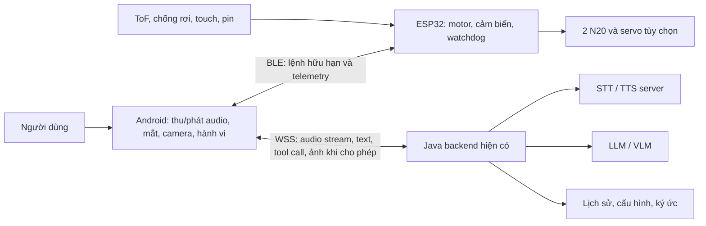

# Kế hoạch RobotAI — robot đồng hành dùng điện thoại Android

Ngày lập: 02/10/2026. Cập nhật: 03/10/2026. Người dùng xác nhận P0 hoàn thành; P1 đang xem xét phần cứng. Chốt kiến trúc chính: STT/TTS tiếng Việt xử lý tại backend server. Tính năng P2 đã được người dùng phê duyệt; bản thiết kế toàn dự án nằm tại [PROJECT_ARCHITECTURE_VI.md](PROJECT_ARCHITECTURE_VI.md), contract tại [P2_PROTOCOL_CONTRACT_VI.md](P2_PROTOCOL_CONTRACT_VI.md). Trạng thái P0 ghi theo xác nhận của người dùng, không bổ sung số đo server chưa được cung cấp.

## 1. Định hướng và phạm vi

Xây dựng robot để bàn lấy cảm hứng từ LOOI: khung in 3D, hai động cơ N20, ESP32 và điện thoại Android cũ. Điện thoại đảm nhiệm màn hình, camera, microphone, loa, thu/phát audio stream, thị giác và hành vi. Backend server đảm nhiệm STT (speech-to-text), TTS (text-to-speech) tiếng Việt và hội thoại AI; Java backend hiện có điều phối phiên, quản lý thiết bị, dữ liệu và công cụ. ESP32 đảm nhiệm điều khiển chuyển động, cảm biến và phản xạ an toàn.

Mục tiêu cuối là các nhóm chức năng công khai của LOOI, không phải cam kết sao chép toàn bộ trải nghiệm độc quyền. Chất lượng chuyển động, biểu cảm, lời thoại và hiệu năng cần được đo trên phần cứng thực tế. Các tính năng LOOI cũng thay đổi theo phiên bản app và hệ điều hành; lập bảng đối chiếu phiên bản trước khi nghiệm thu cuối.

Ba ảnh người dùng cung cấp là tài liệu tham khảo hình dáng và vị trí linh kiện, không phải sơ đồ điện hay bản vẽ kích thước. Ảnh thứ ba thể hiện cảm biến gắn điện thoại, nam châm, sạc không dây, cảm ứng chạm, LED, cảm biến vật cản, ToF và chống rơi. Không suy ra thông số điện, số lượng motor hoặc giao thức từ ảnh.

## 2. LOOI có những gì và hướng tái hiện

Nguồn chính thức: [trang sản phẩm LOOI](https://looirobot.com/products/looi-robot), [ứng dụng do TangibleFuture phát hành](https://play.google.com/store/apps/details?id=com.TangibleFuture.looiRobot), [chính sách quyền riêng tư](https://looirobot.com/pages/privacy-policy). Những nhóm chức năng công bố gồm hội thoại và ghi nhớ, thị giác/cử chỉ, cảm xúc và hành vi tự chủ, tránh vật cản/mép bàn, giấc mơ, thời tiết, camera theo dõi, game vận động, đồng hồ, nhắc việc và sạc điện thoại.

| Nhóm chức năng | Cách làm trong RobotAI | Mốc |
|---|---|---|
| Hội thoại tự nhiên, tính cách | STT/TTS tiếng Việt và LLM ở backend; Android thu/phát audio stream; persona riêng | MVP |
| Ghi nhớ hội thoại và sở thích | Tận dụng lịch sử hội thoại; bổ sung ký ức có thể xem/sửa/xóa | MVP → V1 |
| Mắt và cảm xúc sinh động | Renderer 2D, trạng thái vui/buồn/tò mò/buồn ngủ; đồng bộ âm thanh/chuyển động | MVP → V1 |
| Phản ứng tự nhiên với môi trường | Behavior engine local nhận sự kiện chạm, người xuất hiện, vật cản, giờ trong ngày | MVP → V1 |
| Nhìn người, cử chỉ, hiểu cảnh | Camera trước để tương tác; model local cho mặt/tay; VLM cho câu hỏi về cảnh nếu người dùng bật | V1 |
| Tránh vật cản và mép bàn | Cảm biến tại thân, ESP32 quyết định dừng độc lập | MVP bắt buộc |
| Camera theo dõi/chụp ảnh | Bám vị trí người, xoay thân; thêm servo để đổi góc dọc; lưu ảnh/video trên máy | V1 |
| Game vận động | Game nhận cử chỉ và chuyển động; bắt đầu bằng một game đơn giản | V1 |
| Đồng hồ, nhắc việc, thời tiết | Đồng hồ/nhắc việc local; thời tiết qua dịch vụ dữ liệu | MVP → V1 |
| Giấc mơ và hoạt cảnh | Nội dung dựng sẵn, sau đó sinh câu chuyện/ảnh theo lịch | V1 → V2 |
| Chạm thân, LED, nhận biết điện thoại | Touch pads, LED RGB, công tắc/Hall nhận biết gắn máy | MVP → V1 |
| Gắn điện thoại và sạc | Kẹp cơ khí điều chỉnh; USB ở bản đầu, Qi là tùy chọn cho máy hỗ trợ | MVP → V2 |

Theo trang sản phẩm, LOOI khuyến nghị Android 12+ và Snapdragon 8 Gen1+ hoặc hiệu năng cao hơn, dù máy thấp hơn có thể chạy với hạn chế. Vì vậy không dùng khả năng chạy app LOOI làm điều kiện cho RobotAI: app tự xây cần chế độ nhẹ cho điện thoại cũ. Đây là khuyến nghị của hãng LOOI, không phải yêu cầu tối thiểu đã đo của RobotAI.

## 3. Kiến trúc đề xuất



- Android ↔ ESP32: chọn BLE cho bản đầu; không phụ thuộc Wi-Fi để dừng motor. Cần ESP32 có BLE, kiểm tra đúng biến thể trước khi mua. Wi-Fi local là phương án sau nếu cần telemetry lớn; không truyền camera qua BLE.
- Android ↔ Java: WebSocket/WSS có xác thực, truyền audio Opus hai chiều và JSON điều khiển theo hướng Xiaozhi. Internet hoặc liên kết server mất thì vẫn chạy mắt, chạm, nhắc việc và các lệnh local; hội thoại STT/TTS server không hoạt động.
- Server đề xuất hành động có tên; Android kiểm tra theo trạng thái; ESP32 kiểm tra lần cuối theo cảm biến. LLM không gửi PWM trực tiếp.
- App ở chế độ robot foreground khi gắn điện thoại. Kiểm tra lifecycle, quyền camera/mic/Bluetooth và hạn chế nền theo phiên bản Android.

## 4. Phần cứng và cơ khí

### Cấu hình A: giữ đúng hai động cơ

Hai N20 dẫn động bánh trái/phải, thêm bánh tự do hoặc điểm tựa trượt. Đầu điện thoại cố định, góc nghiêng điều chỉnh bằng tay. Robot tiến/lùi/xoay tại chỗ; cảm xúc thể hiện bằng mắt và xoay thân. Cấu hình này không có gật đầu hoặc ngẩng đầu chủ động.

### Cấu hình B: tiến gần trải nghiệm LOOI

Giữ hai N20 và bổ sung một servo nghiêng đầu. Chỉ thêm servo xoay đầu nếu cần nhìn ngang mà không xoay thân. Chọn torque sau khi đo khối lượng điện thoại, giá đỡ và cánh tay đòn; không chốt servo mini theo tên gọi. Chuyển động đầu phải có giới hạn góc và tránh kéo căng dây sạc.

### BOM sơ bộ

| Thành phần | Số lượng / yêu cầu |
|---|---|
| ESP32 có BLE | 1 board; ưu tiên ESP32-S3 nếu cần dư tài nguyên, ESP32 thường cũng đủ cho điều khiển |
| N20 giảm tốc | 2; ưu tiên encoder, cùng điện áp/tỷ số truyền |
| Driver cầu H hai kênh | 1; đánh giá TB6612FNG hoặc DRV8833 theo điện áp và dòng kẹt motor thực tế |
| Bánh và điểm tựa | 2 bánh cao su + 1 điểm tựa; bánh là bản đầu, xích là tùy chọn sau |
| ToF phía trước | 1–2; chọn theo khoảng đo và góc nhìn |
| Cảm biến chống rơi hướng xuống | Dự kiến 4 vị trí trước/sau trái/phải để bảo vệ cả khi lùi và xoay |
| Touch | 2–3 vùng; dùng khả năng touch của chip nếu hỗ trợ hoặc module ngoài |
| Nhận biết gắn điện thoại | Công tắc nhỏ hoặc Hall + nam châm; không giả định Hall bất kỳ đo được điện thoại |
| LED | Thanh RGB; đèn trước tùy chọn |
| Nguồn | Pin có bảo vệ, sạc phù hợp, công tắc, cầu chì và bộ ổn áp theo thiết kế nguồn |
| Giá đỡ | Kẹp điều chỉnh, đệm mềm, không che camera/mic/loa và cổng |
| Servo đầu | Tùy chọn; chọn theo tải, có nguồn riêng đủ dòng |

N20 chỉ là dạng kích thước, chưa xác định điện áp, tốc độ, torque hoặc dòng kẹt. Chưa mua driver/pin trước khi có datasheet motor. Tính tốc độ bánh theo `v = π × đường kính bánh × rpm / 60`, đo lại dưới tải. Đặt tốc độ bàn thấp, sau đó tăng theo thử nghiệm phanh.

Thiết kế đế thấp và đủ rộng, pin ở đáy, điện thoại gần tâm đế; kiểm tra chống lật ở góc nghiêng đầu lớn nhất. In bản thử đơn giản bằng PLA, sau đó cân nhắc PETG tại vùng chịu tải/nhiệt. Dùng vít và insert tại vị trí bảo trì. CAD tham số hóa chiều rộng điện thoại, đường kính bánh, chiều cao gầm và góc cảm biến.

Nguồn motor/servo và logic cần tách nhánh ổn áp, chung mass phù hợp và có tụ giảm nhiễu. Không cấp motor từ chân 3.3 V của ESP32. MVP dùng nguồn robot riêng và điện thoại tự dùng pin; chức năng sạc điện thoại thêm sau với power-path đúng thiết kế. USB phù hợp nhiều Android cũ hơn Qi; dây cắm ngoài làm hạn chế di chuyển nên có chế độ đứng yên khi nối dây.

## 5. Android: thu/phát audio, STT/TTS tại server

Chốt ngày 03/10/2026: xử lý STT/TTS tiếng Việt tại backend server. Bản offline Android đã thử giữ làm đối chứng, không phải yêu cầu của kiến trúc chính. Kotlin native, Compose cho UI cấu hình, Canvas/renderer 2D cho mắt; CameraX và model mặt/tay nhẹ được đánh giá riêng.

Android thu microphone liên tục trong lượt nói, mã hóa Opus rồi gửi frame ngay qua WebSocket/WSS; nhận phụ đề và audio TTS để giải mã/phát ngay với buffer nhỏ có giới hạn. Bắt đầu bằng giao thức Xiaozhi, uplink mono 16 kHz/frame 60 ms, downlink lấy thông số qua hello. Tách module `audio`, `vision`, `face`, `behavior`, `robot-link`, `backend-client`, `local-data`, `settings`.

MVP dùng push-to-talk hoặc chạm đánh thức. Sau đó đánh giá wake word local, AEC và ngắt lời trên điện thoại thực. Khi ngắt, hủy lượt trả lời ở server và xóa audio đã đệm ở Android; bỏ event/audio thuộc lượt cũ sau reconnect. Chưa mặc định có STT/TTS local dự phòng khi mất mạng.

## 6. Tái sử dụng Java backend

Backend `server-java` đã có WebSocket, quản lý phiên, VAD, khung STT nhận Flux audio/callback partial, LLM, phân câu TTS và xử lý ngắt lời. Nhận xét dựa trên đọc code; chưa xác nhận hiệu năng hoặc vận hành server trong P0 mới.

Cần phân biệt truyền audio liên tục với STT streaming thực sự: provider SenseVoice hiện gom audio đến hết lượt rồi nhận dạng; provider Vosk/FunASR có đường kết quả trung gian nhưng phải xác minh model cụ thể hỗ trợ tiếng Việt và chất lượng phù hợp. PhoWhisper-large trên GPU server là baseline theo đoạn, chưa chốt làm STT chính. VieNeu-TTS-v3-Turbo giọng Hải Đăng tiếp tục là ứng viên TTS, chuyển inference streaming lên server.

Tái sử dụng endpoint `/ws/xiaozhi/v1/`, xác thực và phiên hội thoại. Java điều phối STT → LLM streaming → phân câu → TTS streaming → Android. Model có thể chạy trong worker riêng do Java gọi; không bắt buộc inference trong JVM. Giữ model nạp sẵn và giới hạn hàng đợi/số phiên.

Các việc cần làm: adapter model tiếng Việt; contract partial/final và turn_id; adapter PCM TTS theo phần thay cho đợi file hoàn chỉnh; cancel/reconnect; telemetry độ trễ; bridge tool robot qua Android với lệnh hữu hạn. Không tự gửi từng token LLM vào TTS hoặc cho LLM điều khiển PWM.

Xem [kiến trúc giọng nói server và kế hoạch triển khai](SERVER_VOICE_ARCHITECTURE_VI.md). Tham khảo [giao thức Xiaozhi](https://github.com/78/xiaozhi-esp32/blob/main/docs/websocket.md): binary Opus và JSON hai chiều. WebSocket chạy trên TCP; frame 60 ms không đồng nghĩa STT phải nhận ra một từ mỗi 60 ms.

## 7. Firmware, giao thức và an toàn chuyển động

Firmware ESP-IDF gồm motor controller, sensor polling, BLE service, command validator, watchdog, telemetry và calibration. Nếu có encoder, điều khiển tốc độ vòng kín; không có encoder thì quãng đường/góc chỉ gần đúng.

Contract đề xuất, chưa phải API đã có:

```json
{"v":1,"seq":42,"type":"drive","left":0.15,"right":0.15,"duration_ms":250}
```

`left/right` là setpoint chuẩn hóa theo giới hạn hiệu chỉnh của robot, không phải PWM do LLM quyết định. Payload BLE cần giải quyết MTU, phân mảnh, giới hạn kích thước và ACK. Telemetry: pin, encoder, khoảng cách, cliff, touch, trạng thái gắn máy, fault và số lệnh đã nhận.

Ưu tiên quyết định: dừng khẩn/cảm biến lỗi/mép bàn → vật cản → người điều khiển → hành vi local → AI. Lệnh di chuyển luôn có thời hạn; timeout liên kết ban đầu khoảng 300–500 ms, sau đó chỉnh theo đo BLE và phanh thực tế. Lệnh trùng/hết hạn bị loại; không replay chuyển động sau reconnect.

ESP32 dừng khi mất kết nối, lỗi cảm biến quan trọng, pin thấp hoặc mất điện thoại theo cấu hình. Phát hiện mép bàn ưu tiên dừng; không tự lùi nếu phía sau chưa được xác nhận an toàn. Có công tắc ngắt nguồn motor dễ thao tác.

Khoảng đặt cảm biến phải đủ cho độ trễ cảm biến, xử lý, phanh và phần nhô của bánh/đế. Xấp xỉ `d_an_toàn > v × độ_trễ + quãng_phanh + biên_dự_phòng`. Thử trên mặt bàn sáng/tối/bóng và ánh sáng khác nhau; không khẳng định chống rơi tuyệt đối dựa trên một loại cảm biến.

## 8. Tạo cảm giác robot có sự sống

Behavior engine local dùng state machine hoặc behavior tree. Trạng thái: idle, curious, listening, thinking, speaking, playing, sleepy, fault. Các biến cảm xúc/nhu cầu là mô phỏng, ví dụ mức tò mò, năng lượng, thời gian tương tác và cooldown.

Mỗi hành vi là một hoạt cảnh phối hợp mắt, giọng, LED và động tác hữu hạn. Ví dụ chạm thân → mắt nhìn về phía chạm + âm thanh nhỏ; thấy người → nhìn theo và chào nếu qua cooldown; mất mạng → biểu cảm, trạng thái kết nối và âm thanh thông báo dựng sẵn local. Không gọi LLM cho mỗi lần chớp mắt hoặc chạm.

MVP có khoảng 8–12 biểu cảm và 10–15 hành vi có chất lượng. V1 mở rộng thư viện và tính cách thay vì chỉ tăng animation ngẫu nhiên. Chuyển động vui đùa phải đi qua cùng lớp kiểm tra an toàn.

## 9. Lộ trình và tiêu chí nghiệm thu

Ước lượng cho một người làm đều đặn, đã biết lập trình và có hỗ trợ cơ khí: MVP khoảng 6–8 tuần; V1 thêm 6–10 tuần. Đây là ước lượng lập kế hoạch, phụ thuộc điện thoại, kinh nghiệm, thời gian chờ linh kiện và vòng in sửa, không phải cam kết.

| Giai đoạn | Thời gian dự kiến | Đầu ra và điều kiện qua mốc |
|---|---|---|
| P0: xác minh nền tảng | Tuần 1 | Hoàn thành theo xác nhận của người dùng ngày 03/10/2026; STT/TTS tiếng Việt tại backend. Số đo hiệu năng vẫn phải ghi nhận khi triển khai/nghiệm thu P2 |
| P1: đế di chuyển | Tuần 2–3 | Khung thử, BLE, N20, cliff/ToF; đo phanh; dừng khi ngắt link và lỗi cảm biến |
| P2: robot hội thoại | Tuần 4–5 | F01–F14 đã duyệt; kiến trúc và contract đã lập, chưa triển khai các module mới. Có thể thực hiện trước P1 bằng simulator; 30 lượt liên tiếp không đọc lại câu cũ. Các tính năng bổ sung triển khai tăng dần theo kiến trúc P2 |
| P3: MVP tích hợp | Tuần 6–8 | Touch, hành vi, đồng hồ/nhắc việc, pin; thử liên tục 60 phút và báo cáo nhiệt/độ trễ/lỗi |
| P4: V1 gần LOOI | Thêm 6–10 tuần | Servo đầu, face/gesture tracking, game, camera, ký ức kiểm soát được; đối chiếu từng nhóm tính năng |
| P5: V2 | Sau V1 | Sạc, dock, remote presence, plugin và tối ưu vận hành |

Các kiểm chứng quan trọng:

- Mất liên kết server: báo trạng thái rõ, dừng/khôi phục phiên đúng; lệnh cơ bản, biểu cảm và an toàn motor local vẫn hoạt động. Không nghiệm thu STT/TTS offline như yêu cầu bắt buộc.
- Kiểm tra đường audio: gửi frame khi đang nói; STT provider được chọn có partial/final đúng contract; TTS phát từ phần audio đầu, không chờ cả WAV; không phát lại dữ liệu lượt cũ sau abort/reconnect.
- Ngắt BLE, kill app, tắt màn hình, reboot ESP32 và gây lỗi cảm biến: đo thời gian dừng thực, không chỉ timeout cấu hình.
- Thử mép bàn với dây giữ trên nhiều bề mặt, cả tiến/lùi/xoay; tốc độ chỉ mở sau khi vượt bài thử.
- Đo partial STT đầu tiên, hết nói → final STT, hết nói → audio phản hồi đầu tại Android, RTF, hàng đợi và RAM/VRAM server. Mục tiêu thử ban đầu: final STT khoảng 0,5–1 giây sau hết nói và audio phản hồi đầu khoảng 1–2 giây trong mạng tốt; chưa phải số đo hay cam kết, điều chỉnh sau P0.
- Chạy thu/phát audio stream + camera + mắt 60 phút trên máy mục tiêu; ghi FPS, nhiệt, throttling và pin; ghi tải server và số phiên đồng thời. Không dùng số đo từ điện thoại mạnh hơn thay thế.
- Nhận diện mặt chỉ chứng minh có mặt/vị trí; nhận ra đúng chủ nhân là bài toán riêng cần embedding, đăng ký và đo nhầm lẫn.

## 10. Tính năng tương lai đề xuất

Ưu tiên sau MVP: trợ lý bàn làm việc tiếng Việt (Pomodoro, lịch nhắc, đọc thông báo được cho phép), thú cưng số có tính cách điều chỉnh, luyện hội thoại ngoại ngữ và kể chuyện. Các nhóm này tận dụng đúng phần cứng hiện có.

Sau V1: Home Assistant/MCP cho nhà thông minh; kho hành vi/biểu cảm tùy biến; nhiều robot chia sẻ tác vụ; chế độ offline với LLM trên server nội bộ; điều khiển từ xa có camera và nút dừng local; đế tự sạc với tiếp điểm và marker. Tự docking là dự án định vị/cơ khí riêng, không chỉ thêm một tool AI.

Không ưu tiên ngay SLAM toàn nhà, tự đi cầu thang, LLM lớn chạy trên điện thoại cũ hoặc camera giám sát liên tục: chi phí kỹ thuật cao so với robot để bàn hai N20.

Quyền riêng tư là tính năng sản phẩm: tắt camera/mic dễ dàng, chỉ lưu ký ức khi bật, xem/xóa dữ liệu, chỉ gửi ảnh khi được cho phép. Với kiến trúc đã chốt, audio được gửi tới backend để STT và audio TTS được gửi về Android; xác định lưu giữ/xóa audio và provider nhận dữ liệu theo cấu hình. Chính sách LOOI cũng mô tả việc gửi ảnh cloud tùy chọn; không suy ra toàn bộ dữ liệu của LOOI luôn ở local từ thông điệp quảng bá.

## 11. Thông tin cần chốt để chuyển sang thiết kế chi tiết

1. Model điện thoại, Android, RAM, tình trạng pin và tiếng nói cần hỗ trợ.
2. N20: điện áp, rpm, encoder, torque, dòng kẹt và link/datasheet.
3. Kích thước bàn, ưu tiên bánh hay xích, kích thước tối đa robot.
4. Hai N20 là giới hạn tổng actuator hay được thêm servo đầu?
5. Ngân sách linh kiện và thời gian dành mỗi tuần; chưa có báo giá để lập tổng chi phí đáng tin cậy.
6. Backend sẽ chạy máy local hay máy chủ; CPU/RAM/GPU/VRAM; provider STT/TTS/LLM/VLM và dữ liệu được phép gửi ra ngoài.

Bước hiện tại: triển khai P2 theo [kiến trúc toàn dự án](PROJECT_ARCHITECTURE_VI.md) và [contract hội thoại](P2_PROTOCOL_CONTRACT_VI.md); bắt đầu bằng app robot nhẹ, fake backend/worker và mô phỏng đế. Cấu hình inference và hiệu năng đầu-cuối cần được ghi nhận khi nghiệm thu P2. P1 tiếp tục khi người dùng chốt phần cứng.
